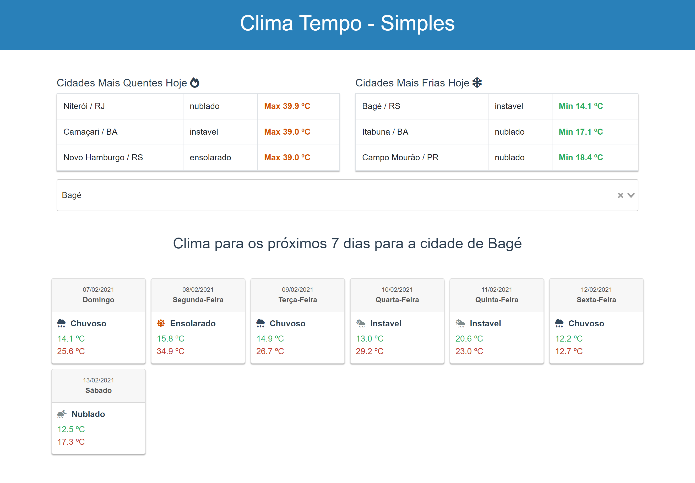

# Teste - Sistema para acompanhar o clima

## Sobre o sistema

    A API foi desenvoldida em Laravel 6 e o Front
    em Vue 2.

## Instalando a API

 Para fazer a instalação basta baxar o conteudo da pasta API
 Após o download basta seguir os passos normais de instalação
 do laravel.

    1 . Composer install
    2 . php artisan serve

### Rotas da API

    1. Listar Cidades: api/cidades
    2. Listar Estados: api/estados
    3. Listar dados da tabela previsao: api/previsao
    4. Listar Cidades com a maior Temperatura: api/maior-temperatura
    5. Listar Cidades com a menor Temperatura: api/menor-temperatura
    6. Listar informações do clima de uma cidade: api/previsao/{iDcidade}/{dias}

## Instalando o FRONT

    Para instalar o fron basta seguir os passos para
    instalação de um projeto em Vue.js:

    1. yarn install
    2. yarn serve

## Banco de Dados

    Foi fornecido um projeto em SQL motivo pelo qual não existe arquivo de
    migrations.

## Para entrar em contato

    Email: **italo.luis.s@gmail.com**

